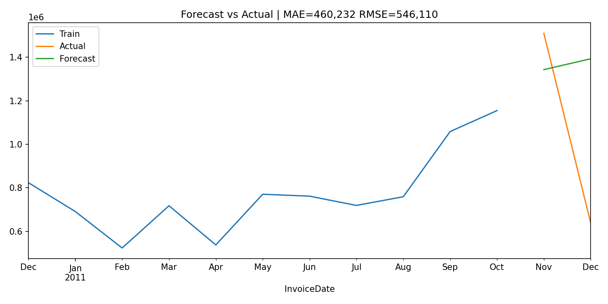
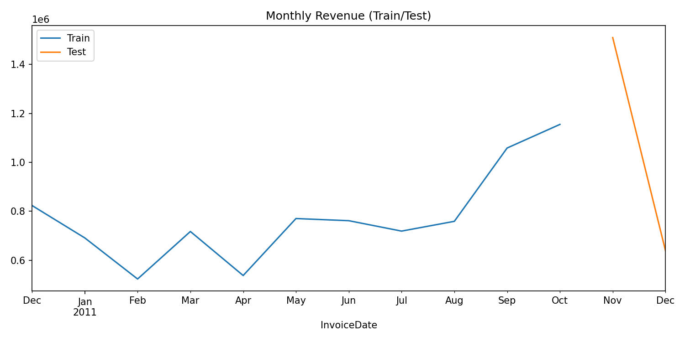
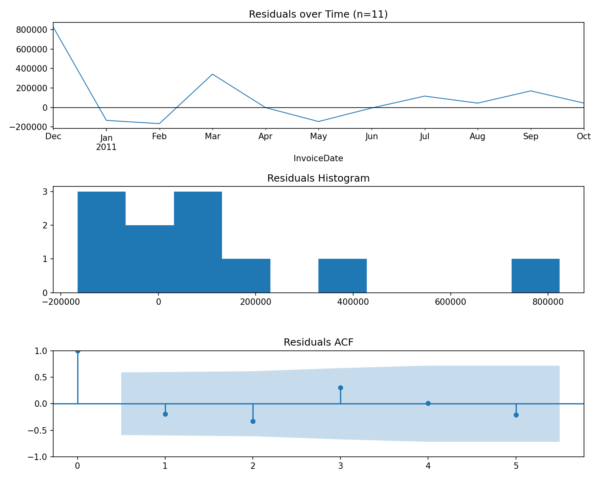

# 🛒 Retail Sales Forecasting (Python)

Forecasting monthly retail revenue using the **UCI Online Retail dataset**.  
Built with **Python, Pandas, Statsmodels, and SARIMAX** to demonstrate real-world time series modeling.

---

## 🔑 Project Highlights
- Cleaned and aggregated **500k+ transaction records** into monthly sales  
- Built and tuned **SARIMA models** to capture trend and seasonality  
- Evaluated performance with **MAE and RMSE**  
- Delivered **visual forecasts, train/test splits, and diagnostics**  

---

## 📊 Results

**Forecast vs Actual**  

**Train/Test Split**  

**Custom Diagnostics (short sample)**  

---

## 🧰 Tools & Tech
- Python (Pandas, NumPy, Matplotlib, Statsmodels, Scikit-learn)  
- Jupyter Notebook  
- GitHub for version control  

---

## 🔍 Notes on Diagnostics
The dataset slice used for modeling contained only **11 months** of sales.  
Because of this, the full SARIMA diagnostics could not run.  
A **custom lightweight diagnostic plot** was created instead to visualize:  
- Residuals over time  
- Histogram of residuals  
- Residual autocorrelation (ACF)  

---

## 🚀 Next Steps
- Extend to multi-year or all-country data for richer forecasts  
- Compare SARIMA with **Prophet or machine learning models**  
- Deploy as an **interactive dashboard** (Streamlit / Power BI)  

---

👤 **Author:** Sage Cain (2025)
